FloWeekTracker is a Polish-language desktop application for Windows, designed for users who want to better manage
their week, boost productivity, and stay motivated. It allows easily planning of taks in a weekly view. Thanks to the
built-in points system, you can reward yourself for completing each task. You decide how many points each task is worth.
When you mark it as done, the assigned points are automatically added to your daily score. Simple, motivating and
effective.

## Table of contents 📜

* [Main features](#main-features)
* [Built with](#built-with)
* [Installation and running](#installation-and-running)
    * [For Developers](#for-developers-)
        * [Requirements](#requirements)
        * [Installation](#installation)
        * [Running](#running)
    * [For end users](#for-end-users-windows)
* [Testing](#testing)
* [Code example/issues](#code-exampleissues)
* [Documentation](#documentation)
* [Licenses](#licenses)
    * [For FloWeek Tracker](#for-floweek-tracker)
    * [For Libraries](#for-used-libraries)
* [Sources](#sources-ℹ-)
* [Contact](#contact)

## Main features ✅

### Database 📂

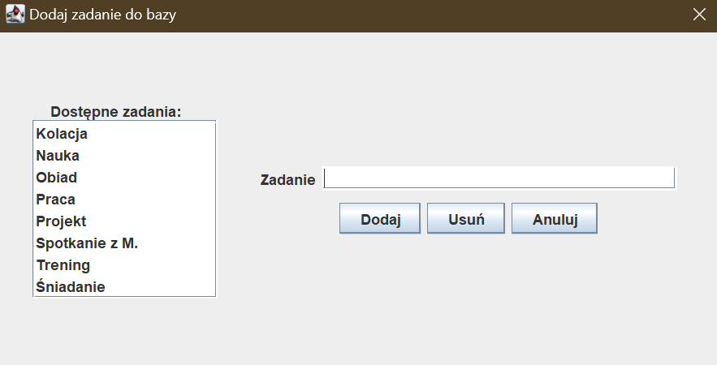

Contains and manages task names to prevent users from entering the same task names. Users can check the task names
list, and also:

<details><summary><b>add task name</b></summary>

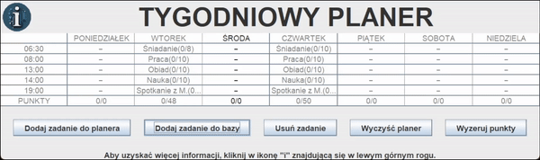
</details>
<details><summary><b>remove task name</b></summary>

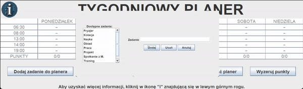
</details>

### Planner 📆

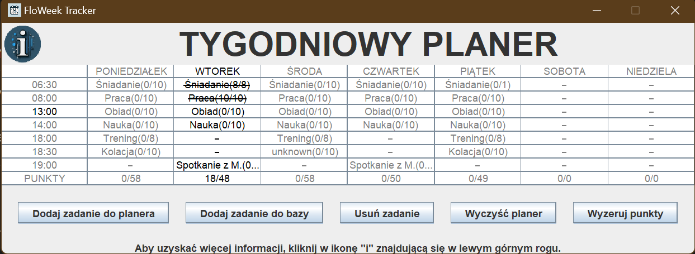

Allows creating a personal weekly calendar where each task includes a description, time, weekday, and points. Users can:

<details><summary><b>add task</b></summary>

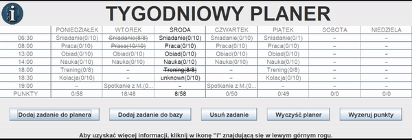
</details>
<details><summary><b>edit task</b></summary>

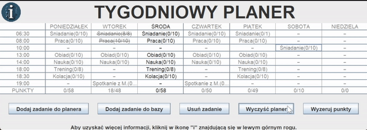
</details>
<details><summary><b>remove task</b></summary>

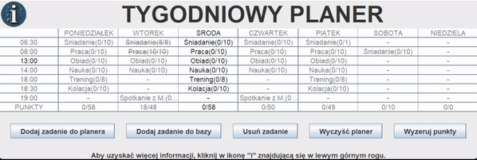
</details>
<details><summary><b>check the daily schedule</b></summary>

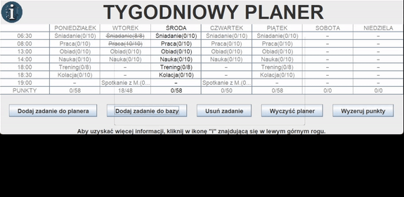
</details>
<details><summary><b>mark task as done</b></summary>

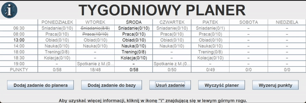
</details>
<details><summary><b>delete multiple tasks</b></summary>

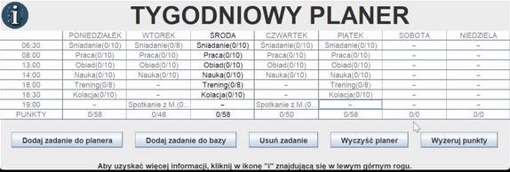
</details>
<details><summary><b>reset points</b></summary>

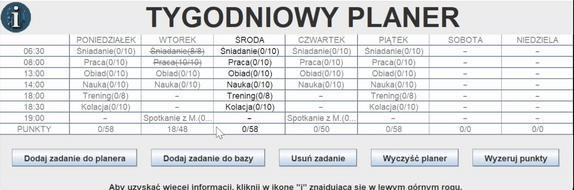
</details>

Users can also view both the total and achieved points. A summary of these points is displayed in the last row of the
weekly planner. Both values update automatically. The total points sum changes when the user adds, removes or edits
tak (e.g. changes the number of points assigned). The achieved points sum changes when the user marks a task as done or
undone, or resets points.

## Built with 🔧

<table>
    <tbody>
        <tr>
            <td></td>
            <td></td>
            <td></td>
            <td></td>
            <td></td>
            <td></td>
        </tr>
        <tr>
            <td style="text-align:center">22</td>
            <td style="text-align:center">3.9.9</td>
            <td style="text-align:center">2.10.1</td>
            <td style="text-align:center">5.11.2</td>
            <td style="text-align:center">1.18.34</td>
            <td style="text-align:center">5.14.2</td>
        </tr>
    </tbody>
</table>

## Installation and running ⚙️

### For developers 💻

<details><summary>Requirements❗</summary>

To run this project locally, you need to have:

* <b>Java 22 or newer</b>: to compile and run the project<br><br>
* <b>Apache Maven 3.9.9 or newer</b>: to manage projects and build the application

You can check your Java version in terminal:

```bash
java -version
```

You can also check your Maven version in terminal:

```bash
mvn -v
```

If you have got an older version, you can download a newer one from:

* <a href="https://www.oracle.com/java/technologies/downloads/">Oracle website</a> (for Java)
* <a href="https://maven.apache.org/download.cgi">Apache Maven website</a> (for Maven)

Make sure both java and mvn commands are available in the PATH environment variable.
</details>

<details><summary>Installation⚙️</summary>
Clone the repository

```bash
git clone https://github.com/Marika9725/FloWeek-Tracker.git
```

Go to the app folder

```bash
cd FloWeekTracker
```

Build the project

```bash
mvn clean install
```

</details>

<details><summary>Running▶️</summary>

```bash
java -jar target/FloWeekTracker-1.0-jar-with-dependencies.jar
```

</details>

### For end users (Windows) 🪟

1. Download FloWeekTracker.exe from the <a href="https://github.com/Marika9725/FloWeek-Tracker/releases">
   releases</a>.<br><br>
2. After downloading the file, run it and follow the displayed instructions to install the application on your
   desktop.<br><br>
3. After installing an application, double-click on the app icon.<br><br>
4. Enjoy using the application.

## Testing 🧪

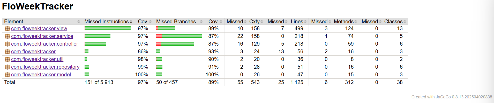

This application was developed following <b>Test Driven Development (TDD)</b> methodology. Unit tests were implemented
using <b>JUnit 5</b> and <b>Mockito</b> frameworks. All tests passed successfully. Test coverage was measured by
<b>JaCoCo</b> - achieving <b>about 97% instructions coverage and 89% branches coverage</b>. These results show that the core 
logic and different code paths are well tested, which makes application more stable and easier to develop future.

To run the tests and check details about test coverage, follow the steps below:

1. Clone the repository.
2. Run command:
   ```bash
   mvn test
   ```
3. Check the test coverage report in the `target/site/jacoco/index.html` file.

## Code Example/Issues 🔎

If you have any issues, please let me know in the <a href="https://github.com/Marika9725/FloWeek-Tracker/issues">issues
section</a> or directly at <a href="mailto:m.szewczyk2@o2.pl">m.szewczyk2@o2.pl</a>

## Documentation 📑

Full documentation of the FloWeek Tracker is
available <a href="https://marika9725.github.io/FloWeek-Tracker/FloWeekTracker/module-summary.html">here</a>. It
contains detailed information about the constructed packages, classes, methods and fields.

## Licenses 🔱

For complete license terms, see the [LICENSE](LICENSE.md) file.

### For FloWeek Tracker 🔱

This software is licensed under a custom license with the following terms:

1. **Usage:** For personal use and recruitment purposes only. Commercial use is prohibited.
2. **Modification:** No modifications are allowed. The software must remain unchanged.
3. **Redistribution:** Redistribution, sale, or offering of the software is not permitted.
4. **Attribution:** Proper credit must be given to the original author.
5. **Privacy:** Data is stored locally on your device. Compliance with data protection laws is your responsibility.
6. **Dependencies:** Includes libraries licensed under GNU GPL-2.0 and Apache License 2.0. These licenses apply to the
   libraries but not to my own code.
7. **Contact:** For issues, contact <a href="mailto:m.szewczyk2@o2.pl">email</a>
   or <a href="www.linkedin.com/in/maria-szewczyk/">LinkedIn</a>
8. **Disclaimer:** Provided "as if" without warranties. The Licensor is not liable for any damages.

### For used libraries 🔱

* **Maven**: Apache 2.0 license
* **Gson**: Apache 2.0 license
* **Java**: GPL 2.0 license
* **Lombok**: MIT license
* **JUnit**: Eclipse Public License 2.0
* **Mockito**: MIT license
* **AssertJ**: Apache 2.0 license
* **Hamcrest**: BSD license
* **Awaitility**: Apache 2.0

## Sources ℹ️ ️

The application was created to practice the knowledge gained from:

* "Java: A Beginner's Guide. Eighth Edition" by Herbert Schildt,
* <a href="https://www.udemy.com/course/kurs-java-od-podstaw-od-zera-do-mastera-zbuduj-wlasne-aplikacje/learn/lecture/24333546?start=0#overview"> Java course from Udemy, created by Kuba Wąsikowski</a>,
* <a href="https://www.youtube.com/watch?v=tvHVafvw16Y&list=PLj-pbEqbjo6AKsJ8oE2pvIqsb15mxdrxs&ab_channel=Zaprogramuj%C5%BBycie">
  Git course created by Mateusz</a>
* <a href="https://www.udemy.com/course/testy-jednostkowe/learn/lecture/14103154?start=0"> "Testy jednostkowe - JUnit 5, Mockito 2, TDD" by Dawid Nowak and Paweł Ćwik</a>

## Contact 📞

<a href="https://www.linkedin.com/in/maria-szewczyk/">
</a>

<a href="mailto:m.szewczyk2@o2.pl">
</a>
